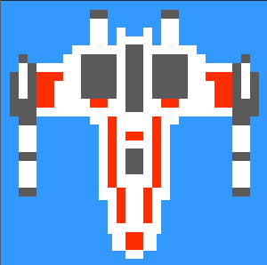

# X Wing : Pixel Art
#####Pure CSS X Wing!
<div style="text-align:center">

</div>

 

###Installation

****

```js
npm i pixelated-pure-css-x-wing
```

```js
yarn add pixelated-pure-css-x-wing
```

### Basic Usage

****

This is the minimal configuration.

```
import PixalatedPureCssXWing from 'pixelated-pure-css-x-wing'
```

```
<PixalatedPureCssXWing />
```

The components can be configured with height, width or rotation.

````
 <PixalatedPureCssXWing rotation="270deg" height="100px" />
````

````
 <PixalatedPureCssXWing rotation="90deg" height="20vh" width="300px" />
````

##### Default Props

````
height:'300px'
width:'300px'
rotation:null
````


